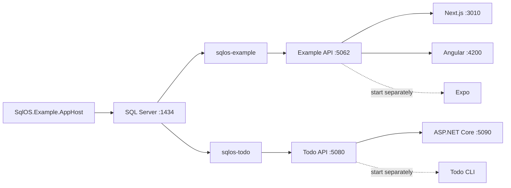

# SqlOS examples

These samples are working reference applications, not isolated snippets. They show how a .NET host configures SqlOS, how browser and native clients complete OAuth flows, how protected APIs enforce tokens and fine-grained authorization, and how the pieces run together under .NET Aspire.

## Choose the shortest path to your goal

| You want to… | Start here | Why |
| --- | --- | --- |
| See the smallest complete host | [One-call sample](SqlOS.OneCall.Api/README.md) | One `AddSqlOS` call declares the API and MCP surfaces, branding, and FGA model; no `MapSqlOS`, token filters, or MCP wiring in `Program.cs` |
| Run multiple clients against one Todo host | [Todo API](SqlOS.Todo.Api/README.md) + `SqlOS.Todo.AppHost` | One .NET API, hosted sign-in, a protected Todo resource, FGA, and Swagger |
| Run one identity host for Next.js, Angular, and Expo | [Full example AppHost](SqlOS.Example.AppHost/README.md) | Runs the example API, Todo API, SQL Server, and three web clients together |
| Integrate a server-rendered .NET app | [ASP.NET Core client](SqlOS.Example.AspNetCoreWeb/README.md) | Razor Pages, ASP.NET Core OAuth middleware, PKCE, encrypted cookies, and a protected API call |
| Integrate a JavaScript browser app | [Next.js client](SqlOS.Example.Web/README.md) or [Angular client](SqlOS.Example.AngularWeb/README.md) | Hosted and headless auth via Auth.js / angular-oauth2-oidc, token refresh, and FGA-filtered retail screens |
| Integrate a native mobile app | [Expo client](SqlOS.Example.ExpoApp/README.md) | Custom-scheme callback, expo-auth-session, SecureStore, refresh tokens, and protected APIs |
| Build a terminal sign-in flow | [Todo CLI](SqlOS.Todo.Cli/README.md) | OAuth device authorization, browser handoff, polling, token refresh, and CLI API calls |
| Offer "Sign in with your app" to other apps | [Sign in with X](SqlOS.SignInWithX.AppHost/README.md) | SqlOS as an OpenID Provider: a Next.js + Auth.js relying party federates via pure OIDC discovery, with the consent screen and remembered grants |

Start with the [Notes sample](SqlOS.OneCall.Api/README.md) for `UseSingleApplication`, browser login, a protected API, and hosted MCP tools. Use Todo or the full example for `ConfigureApplication` with several explicit clients.

## Which hosts use which API?

| Host | Application configuration | Why |
| --- | --- | --- |
| [Notes](SqlOS.OneCall.Api/NotesApplication.cs) | `UseSingleApplication`, `Api`, `Mcp`, `Brand`, `Authorization` | One derived browser client and API/MCP surfaces in the same process |
| [Retail](SqlOS.Example.Api/Program.cs) | `ConfigureApplication`, `Brand`, `Headless`, `Authorization` | Explicit Next.js, Angular, and Expo clients share one identity host |
| [Todo](SqlOS.Todo.Api/Program.cs) | `ConfigureApplication`, `Brand`, optional `Headless`, `Authorization` | Explicit hosted-web, Razor Pages, CLI, and broker clients share the Todo resource |
| [App X](SqlOS.SignInWithX.AppX/Program.cs) | `ConfigureApplication`, `Brand` | Dedicated OIDC provider with an explicit third-party App Y client; no local business API |

The retail sample retains its demo credential middleware and public auth/demo routes. Todo retains its configured resource audience (`/api/todos` by default), per-operation scopes, and explicit metadata. Declaring a bearer-only `Api = "/api"` would change those contracts. Notes demonstrates the new derived API/MCP protection.

The relying-party applications continue to use Auth.js, `angular-oauth2-oidc`, ASP.NET Core OpenID Connect, and Expo's client integration. They do not host SqlOS, so the .NET application-description API does not apply to them. Hosted AuthPage and `@sqlos/headless` continue to work through those clients.

## Run the full example

Prerequisites:

- .NET 9 SDK
- Docker Desktop or another Docker-compatible runtime
- Node.js and npm
- available local ports listed below

From the repository root:

```bash
npm ci --prefix packages/headless && npm run build --prefix packages/headless
npm ci --prefix examples/SqlOS.Example.Web
npm ci --prefix examples/SqlOS.Example.AngularWeb
dotnet run --project examples/SqlOS.Example.AppHost/SqlOS.Example.AppHost.csproj
```

Wait for the Aspire resource table to show the applications as running, then open:

| URL | What is there |
| --- | --- |
| `http://localhost:5062/swagger` | Application API reference |
| `http://localhost:5062/sqlos` | SqlOS administration dashboard |
| `http://localhost:5090` | ASP.NET Core Razor Pages client |
| `http://localhost:3010` | Next.js client |
| `http://localhost:4200` | Angular client |
| `http://localhost:5080` | Todo sample |

The checked-in dashboard password is `your-strong-password`. It exists only to make the local sample runnable; replace it for any shared or deployed environment.

The full AppHost launches exactly these resources:



It does **not** start the Expo app or Todo CLI. Those are separate clients that connect to an already-running backend.

## Example catalog

| Project | Started by | Default address | What it demonstrates |
| --- | --- | --- | --- |
| [`SqlOS.Example.AppHost`](SqlOS.Example.AppHost/README.md) | You | Aspire dashboard on HTTPS port `18888` | Full local orchestration, SQL resources, configuration forwarding |
| [`SqlOS.Example.Api`](SqlOS.Example.Api/README.md) | Full AppHost | `http://localhost:5062` | Embedding SqlOS in ASP.NET Core, AuthServer, dashboard, MFA, SSO helpers, FGA, protected APIs |
| [`SqlOS.Example.AspNetCoreWeb`](SqlOS.Example.AspNetCoreWeb/README.md) | Both AppHosts | `http://localhost:5090` | Built-in ASP.NET Core OpenID Connect handler, PKCE, ID token + UserInfo claims, cookie session, and a Todo-resource API call |
| [`SqlOS.Example.Web`](SqlOS.Example.Web/README.md) | Full AppHost | `http://localhost:3010` under Aspire; `3000` standalone | Next.js, hosted and headless auth, NextAuth, MFA, SSO portal, retail FGA UI |
| [`SqlOS.Example.AngularWeb`](SqlOS.Example.AngularWeb/README.md) | Full AppHost | `http://localhost:4200` | Angular, hosted and headless auth, browser PKCE, retail FGA UI |
| [`SqlOS.Example.ExpoApp`](SqlOS.Example.ExpoApp/README.md) | You, separately | Simulator/device | Expo Router, native OAuth callback, SecureStore, protected retail UI |
| [`SqlOS.Example.Tests`](SqlOS.Example.Tests/SqlOS.Example.Tests.csproj) | Test runner | n/a | ASP.NET Core access-token refresh, ticket renewal, and logout fallback |
| [`SqlOS.Example.IntegrationTests`](SqlOS.Example.IntegrationTests/SqlOS.Example.IntegrationTests.csproj) | Test runner | n/a | Real-SQL tests for example auth, OIDC, email OTP, dashboard, workspaces, and retail FGA |
| [`SqlOS.Example.E2eTests`](SqlOS.Example.E2eTests/SqlOS.Example.E2eTests.csproj) | Test runner | Boots the full AppHost on `5162`/`3110`/`4300`/`1439` | Playwright journeys through the Next.js and Angular headless UIs: `@sqlos/headless` in a real browser, MFA enrollment, and the host OIDC library finishing `/token` |
| [`SqlOS.Todo.AppHost`](SqlOS.Todo.AppHost/SqlOS.Todo.AppHost.csproj) | You | Aspire dashboard on HTTPS port `18890` | Focused SQL + Todo API + Razor client stack |
| [`SqlOS.Todo.Api`](SqlOS.Todo.Api/README.md) | Either AppHost | `http://localhost:5080` | Hosted auth, resource metadata, audience validation, Todo FGA, CIMD and optional DCR |
| [`SqlOS.Todo.Cli`](SqlOS.Todo.Cli/README.md) | You, separately | Terminal | Device authorization grant and Todo API calls |
| [`SqlOS.Todo.IntegrationTests`](SqlOS.Todo.IntegrationTests/SqlOS.Todo.IntegrationTests.csproj) | Test runner | n/a | Real-SQL tests for Todo auth, FGA, device flow, CIMD, and DCR |

`SqlOS.Example.Tests` provides fast application-session coverage; the two integration-test projects provide executable real-SQL protocol and authorization coverage; `SqlOS.Example.E2eTests` proves the browser clients end to end.

## Ports and local state

| Port | Owner |
| --- | --- |
| `1434` | Full example SQL Server container |
| `1435` | Todo-only SQL Server container (`SqlOS:DatabaseProvider=SqlServer`) |
| `3010` | Next.js under the full AppHost |
| `4200` | Angular |
| `5062` | Example API and SqlOS host |
| `5080` | Todo API |
| `5090` | ASP.NET Core client |
| `18888` / `18889` | Full AppHost dashboard / OTLP endpoint |
| `18890` / `18891` | Todo AppHost dashboard / OTLP endpoint |

The full example AppHost uses a persistent SQL Server container. The Todo-only AppHost defaults to a persistent PostgreSQL container (`UseNpgsql`) and uses SQL Server on port `1435` only when `SqlOS:DatabaseProvider=SqlServer`. Stopping the AppHost does not erase users, clients, grants, or sample data. To start fresh, stop the AppHost and deliberately remove its database container and associated data volume, or drop the disposable sample database. Do not do that if the volume contains data you care about.

The full stack uses separate `sqlos-example` and `sqlos-todo` databases in one SQL Server container. The Todo-only AppHost uses its own database container and `sqlos-todo` database.

## Optional provider configuration

Password auth works without external services. These provider-backed features work only after their settings are supplied to the full AppHost. The broad example can render its email-code option before delivery is configured; sending still requires ACS.

| Feature | Required configuration |
| --- | --- |
| Email delivery and email OTP | `SqlOS:Email:AzureCommunicationServicesConnectionString` and `SqlOS:Email:FromAddress`, or `AZURE_EMAIL_CONNECTION_STRING` and `AZURE_EMAIL_SENDER_ADDRESS`; Todo also requires `TodoSample__EnableEmailOtp=true` |
| Phone OTP | `SqlOS:PhoneOtp:Enabled=true` plus `TWILIO_ACCOUNT_SID`, `TWILIO_AUTH_TOKEN`, and `TWILIO_VERIFY_SERVICE_SID` |
| Microsoft social login | `AZURE_OIDC_MICROSOFT_CLIENT_ID` and `AZURE_OIDC_MICROSOFT_CLIENT_SECRET`; tenant is optional |

Use environment variables or AppHost user-secrets. Never commit provider secrets.

## Verify the examples

Build the clients:

```bash
dotnet build examples/SqlOS.Example.AppHost/SqlOS.Example.AppHost.csproj
dotnet build examples/SqlOS.Todo.Cli/SqlOS.Todo.Cli.csproj
dotnet test examples/SqlOS.Example.Tests/SqlOS.Example.Tests.csproj
./scripts/setup-js-examples.sh --expo
npm run build --prefix examples/SqlOS.Example.Web
npm run build --prefix examples/SqlOS.Example.AngularWeb
npm exec --prefix examples/SqlOS.Example.ExpoApp -- tsc --noEmit -p examples/SqlOS.Example.ExpoApp/tsconfig.json
```

Run the real-SQL integration suites with Docker available:

```bash
dotnet test examples/SqlOS.Example.IntegrationTests/SqlOS.Example.IntegrationTests.csproj
dotnet test examples/SqlOS.Todo.IntegrationTests/SqlOS.Todo.IntegrationTests.csproj
```

Run the browser end-to-end tests for the headless Next.js and Angular UIs (Docker, Node, and Chromium; the tests install Chromium on first run):

```bash
./scripts/headless-e2e.sh
```

They boot the full AppHost on alternate ports (`5162` API, `3110` Next.js, `4300` Angular, `1439` SQL) with an ephemeral database, so a demo already running on the default ports is not disturbed. CI runs the same script as the `Headless Examples E2E` job.

## What to copy into your application

- Start with [the API composition root](SqlOS.Example.Api/Program.cs) and [application DbContext](SqlOS.Example.Api/Data/ExampleAppDbContext.cs) to see the .NET integration boundary.
- Use the [ASP.NET Core client](SqlOS.Example.AspNetCoreWeb/Program.cs) for a server-rendered .NET OAuth integration.
- Use the [Next.js Auth.js provider](SqlOS.Example.Web/lib/auth.ts), [Angular OIDC config](SqlOS.Example.AngularWeb/src/app/auth.config.ts), or [Expo auth-session helper](SqlOS.Example.ExpoApp/services/sqlos-auth.ts) for client-specific reference flows. Do not copy a hand-rolled PKCE helper.
- Read the relevant sample README before copying security or storage choices. Several conveniences are intentionally local-demo defaults, and each guide calls them out.
