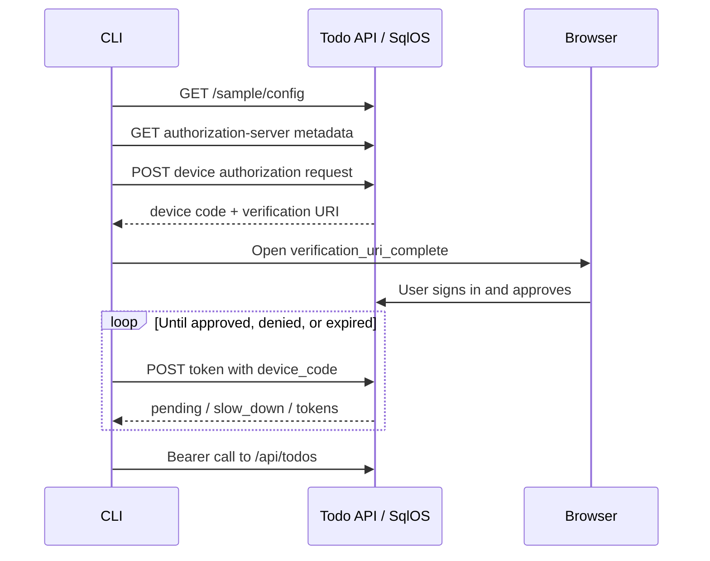

# SqlOS Todo CLI

This .NET 9 console application is a complete OAuth device-authorization client for the SqlOS Todo sample. It discovers the server configuration, starts device login, opens or prints the verification URL, polls according to the protocol, stores the resulting tokens, refreshes expired access tokens, and calls the protected Todo API.

It is intentionally separate from Aspire. Neither AppHost launches the CLI.

## What it demonstrates

- discovery of sample client, issuer, audience/resource, and scopes
- OAuth authorization server metadata discovery
- device authorization grant for a public CLI client
- browser handoff with a human-readable device code
- `authorization_pending`, `slow_down`, denial, and expiration handling
- bearer calls to `/api/me` and `/api/todos`
- refresh-token use when the access token expires
- a configurable API origin for local or remote development

## Start the Todo backend

Prerequisites:

- .NET 9 SDK
- Docker Desktop or another Docker-compatible runtime
- free ports `5080`, `18890`, and `18891` (plus `1435` when you opt into SQL Server)

From the repository root:

```bash
dotnet run --project examples/SqlOS.Todo.AppHost/SqlOS.Todo.AppHost.csproj
```

This starts:

- a persistent PostgreSQL container by default (set `SqlOS:DatabaseProvider=SqlServer` for SQL Server on host port `1435`);
- the `sqlos-todo` database;
- the Todo API, UI, hosted AuthPage, and Swagger at `http://localhost:5080`;
- the Aspire dashboard on its printed authenticated URL, configured for HTTPS port `18890`.

You may instead use the [full example AppHost](../SqlOS.Example.AppHost/README.md), which also runs the Todo API on `5080`. Do not run both AppHosts at the same time because both try to own that API port.

Read the [Todo API guide](../SqlOS.Todo.Api/README.md) for the resource metadata, FGA hierarchy, local clients, CIMD, and optional DCR behavior.

## Sign in

In a second terminal:

```bash
dotnet run --project examples/SqlOS.Todo.Cli/SqlOS.Todo.Cli.csproj -- login
```

The CLI prints:

- a verification URL;
- the short device code;
- progress while it polls the token endpoint.

It also attempts to open the URL with `open` on macOS, `cmd /c start` on Windows, or `xdg-open` on Linux. Browser launch is best-effort; copy the printed URL if no browser opens.

Complete sign-in in the browser. The CLI stores the access and refresh token response and returns when authorization succeeds.

## Use the API

```bash
# Show the authenticated identity and token context.
dotnet run --project examples/SqlOS.Todo.Cli/SqlOS.Todo.Cli.csproj -- whoami

# List visible todos.
dotnet run --project examples/SqlOS.Todo.Cli/SqlOS.Todo.Cli.csproj -- list

# Create a todo.
dotnet run --project examples/SqlOS.Todo.Cli/SqlOS.Todo.Cli.csproj -- add "Ship the CLI"

# Toggle a todo returned by list.
dotnet run --project examples/SqlOS.Todo.Cli/SqlOS.Todo.Cli.csproj -- toggle <todo-id>

# Remove the locally stored login.
dotnet run --project examples/SqlOS.Todo.Cli/SqlOS.Todo.Cli.csproj -- logout
```

The available commands are:

| Command | API behavior |
| --- | --- |
| `login` | Discovers the client/server and completes device authorization |
| `whoami` | `GET /api/me` |
| `list` | `GET /api/todos` and compact terminal formatting |
| `add "<text>"` | `POST /api/todos` |
| `toggle <todo-id>` | `POST /api/todos/{id}/toggle` |
| `logout` | Deletes the local token file |

If an access token is within 60 seconds of expiry, the CLI refreshes it before sending the API request and persists the rotated access/refresh token pair.

## Device authorization flow

The implementation in [`Program.cs`](Program.cs) follows this sequence:



The client does not hard-code token or device endpoints. It obtains the Todo issuer/resource/client from `/sample/config`, then reads `token_endpoint` and `device_authorization_endpoint` from OAuth authorization-server metadata.

The client still has a default API base because it needs an initial discovery location.

## Target another Todo deployment

Override the initial API origin:

```bash
SQLOS_TODO_API_ORIGIN=https://todo.example.com \
dotnet run --project examples/SqlOS.Todo.Cli/SqlOS.Todo.Cli.csproj -- login
```

The target must expose the Todo sample's `/sample/config` contract and authorization-server metadata. The discovered public client must allow device authorization for the returned resource and scopes.

After login, the token file remembers the discovered API base and uses that same origin for later refresh discovery. `SQLOS_TODO_API_ORIGIN` selects the target for a new login; sign in again when moving between environments.

## Headless terminals

`login` prints `verification_uri_complete` and then tries to open it with the platform opener. Pass `--no-browser` or set `SQLOS_TODO_CLI_NO_BROWSER=1` to skip the launch and only print the URL, for example over SSH or in automation:

```bash
SQLOS_TODO_CLI_NO_BROWSER=1 \
dotnet run --project examples/SqlOS.Todo.Cli/SqlOS.Todo.Cli.csproj -- login
```

## Token storage and logout

Tokens are serialized as readable JSON at:

```text
~/.sqlos/todo-cli/tokens.json
```

Set `SQLOS_TODO_CLI_HOME=<directory>` to store `tokens.json` somewhere else, for example one directory per environment or a throwaway directory for tests.

The record contains API base, issuer, client ID, resource, access token, refresh token, and access-token expiry. The sample creates the directory and file but does not add operating-system keychain protection or explicit file-permission hardening.

That is useful for understanding the flow, but it is not a production credential store. A real CLI should use the platform keychain/credential vault where available, restrict fallback file permissions, and define token cleanup/revocation behavior.

The current `logout` command deletes only the local file. It does **not** call the server's logout/revocation endpoint, so the refresh token may remain valid until it expires or is revoked elsewhere.

## Build and test

Build the CLI:

```bash
dotnet build examples/SqlOS.Todo.Cli/SqlOS.Todo.Cli.csproj
```

Run the Todo integration suite with Docker available:

```bash
dotnet test examples/SqlOS.Todo.IntegrationTests/SqlOS.Todo.IntegrationTests.csproj
```

The suite covers the Todo API's hosted/headless auth, audience/resource validation, FGA, CIMD, and DCR behavior over HTTP. It does not launch the CLI executable.

The CLI binary itself is covered by the Playwright suite in [`examples/SqlOS.Todo.E2eTests`](../SqlOS.Todo.E2eTests/TodoE2eTests.cs), which CI runs as the `Todo Web + CLI E2E (PostgreSQL)` job:

```bash
./scripts/todo-e2e.sh
```

It boots the Todo app host on PostgreSQL, runs the built `SqlOS.Todo.Cli.dll` as a child process with `SQLOS_TODO_API_ORIGIN`, `SQLOS_TODO_CLI_NO_BROWSER=1`, and a temporary `SQLOS_TODO_CLI_HOME`, reads the verification URL from stdout, creates an account and approves (or denies) the request in Chromium, and then asserts that `login` exits with tokens, `whoami`/`add`/`list` work with them, `logout` removes them, and a denied login exits non-zero without writing tokens. Your real `~/.sqlos/todo-cli` is never touched.

## Reset and troubleshooting

### `Not signed in. Run login first.`

The token file is absent or unreadable. Start the backend and run `login`.

### The browser did not open

Use the printed `verification_uri_complete` URL. Headless terminals and minimal Linux installations may not provide a supported opener; pass `--no-browser` to skip the attempt.

### Device code expired

Run `login` again. Device codes are short-lived and single-use.

### API calls return an audience/resource error

Do not substitute a token from the full example API. The Todo API requires its own resource, `http://localhost:5080/api/todos` in local development. Let the CLI discover and request it.

### Start over locally

Run `logout` or delete `~/.sqlos/todo-cli/tokens.json` to clear only the CLI credential. Users, grants, and todos remain in the AppHost's persistent SQL volume. Stop the AppHost and deliberately remove its SQL container/volume only when all sample state is disposable.

## Local-sample limitations

- Tokens are stored in a plain JSON file rather than the platform credential vault.
- Local logout does not revoke the server-side refresh token/session.
- Browser opening supports only the three best-effort platform commands in `Program.cs`.
- There is no dedicated executable-level CLI test project.
- The default backend uses HTTP localhost. Use HTTPS for a remote or production issuer.
